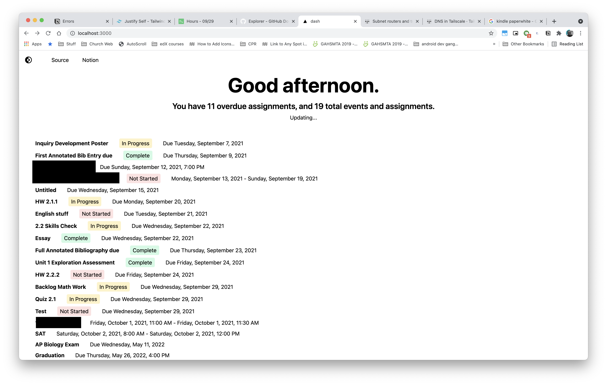

# dash

A simple personal dashboard built with Next.js + Tailwind CSS and backed by my Notion tasks database and TickTick to-do list (TickTick code adapted from [its Raycast extension](https://github.com/raycast/extensions/tree/main/extensions/ticktick/src/service)).

I wanted to have a simple site so I could open it on an old e-ink Kindle using the Experimental Browser, and somehow mount the Kindle in my room so I can see my tasks at a glance without opening Notion on my phone or computer. Unfortunately that didn't work out. I'm not sure if maybe there's something I need to polyfill or if React is just too big to run on a Kindle, because the Kindle just freezes when I try to load the page. AFAIK there isn't any way to pull up a console to see any errors so that sucks, but the site does work on other devices!

This site does occasionally have stuff I'd like to keep private, so I'll eventually have it deployed on a device at home that is also on a private [Tailscale](https://tailscale.com/) network so I can still access it off my home network at [https://d.jasonaa.me](https://d.jasonaa.me). If you try to hit that domain you probably won't get anything since it'll resolve to a internal Tailscale IP address that only routes to the web server if you are connected to my Tailscale network.

I still want to get this to run on an e-ink display of some sort, ideally without spending any extra money, so I'll eventually be trying a couple things to get this working.

- Try to use a terminal browser like `lynx` or `w3m` on the Kindle, kinda like how it's done [here](http://blog.yarm.is/kindleberry-pi-zero-w.html) and [here](https://ponnuki.net/2012/09/kindleberry-pi/)
  - I've already jailbroken the Kindle so I'd just need to figure out how to install a terminal emulator and enable USB networking.
  - I tested this site with `lynx` and `w3m` on my laptop, and it looks like neither of them can actually run JavaScript. Next came in clutch here since it server-rendered the page and served that, but the page isn't able to auto refresh so I've kinda given up on this :/
- Rebuild this site as a TUI and use a similar approach to the one above to run it on the Kindle.
  - I feel like this might be one of the better ideas I've come up with, and I've been wanting to build something in Rust or Go for a while 👀
- Make a simpler version of the site using mostly vanilla JS
  - This might be a good option but also like, idk what browser APIs I can and can't use on the Kindle, plus there's still the chance I run into the same issues I encountered with this site
  - Overall I don't think it'd be as fun as building a TUI so I think I'll just do that instead

## March 2022 update

Surprise surprise - I haven't done any of the things I said I would. I did update dash to add support for TickTick since I've switched to that for to-dos. dash runs on my personal machine now instead of on a server on my Tailnet, since my school wifi doesn't seem to like me being on Tailscale all the time :/ I also set dash as my new tab page ~~so i can be called out aboonut late tasks when im about to procrastinate~~. The TickTick code is kinda wack since I was too lazy to refactor stuff to make it less dependent on Notion, so I'll probably want to refactor that at some point. But that's a problem for future me 🥱
